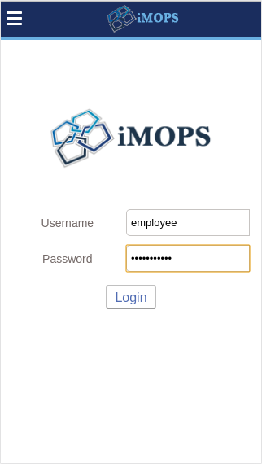

# README #

IMOPS (Ingenious Meal Oriented Paying System).

### Usage? ###

* Diploma thesis on FIIT STU. Purpose of this project is to transform already used paper meal vouchers to electronic ones. There is an ability to limit or filter the bought stuff by category at payind.
* v 1.0

## Preview

### How do I get set up? ###

* Summary of set up
* Configuration
* Dependencies
* Database configuration
* How to run tests
* Deployment instructions

### Contribution guidelines ###

* Writing tests
* Code review
* Other guidelines

### Who do I talk to? ###

* Repo owner or admin
* Other community or team contact
